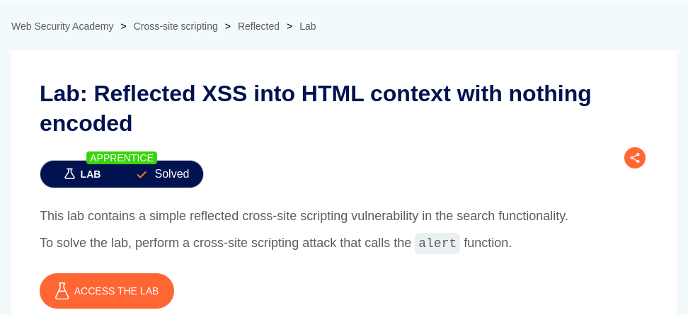
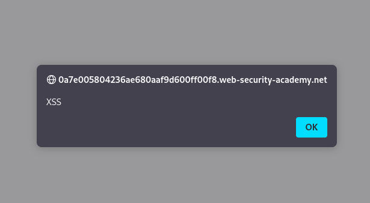

# Reflected XSS into HTML context with nothing encoded

**Lab Url**: [https://portswigger.net/web-security/cross-site-scripting/reflected/lab-html-context-nothing-encoded](https://portswigger.net/web-security/cross-site-scripting/reflected/lab-html-context-nothing-encoded)



## Analysis

The initial step is to understand how the vulnerable application works and gather information about the target system. The application serves as a collection of blog posts. There is also an interesting search bar above the post collections.

The search bar filters the blog according to the search term. But it doesn't perform any type of encoding and display user queries on DOM.

Let's see if we can inject a `<script></script>` tag inside of DOM. It is possible to inject the `<script></script>` tag as we type the `<script></script>` into the search bar we got the following in the application's inner HTML.

```html
<h1>0 search results for '<script></script>'</h1>
```

## Solution

Since the application executes the user-supplied query in this case the `<script></script>` tag without any encoding or validation it is possible to perform an **XSS** Attack.

**Payload:**

```html
<script>alert('XSS')</script>
```

**URL:**

```bash
/?search=<script>alert('XSS')</script>
```




