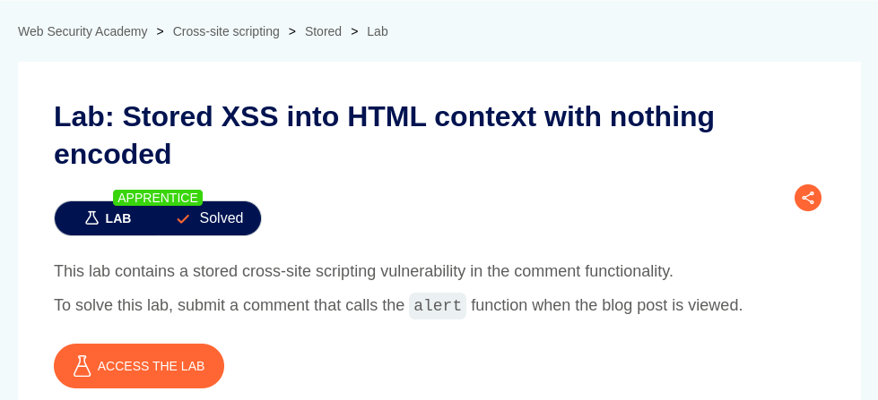
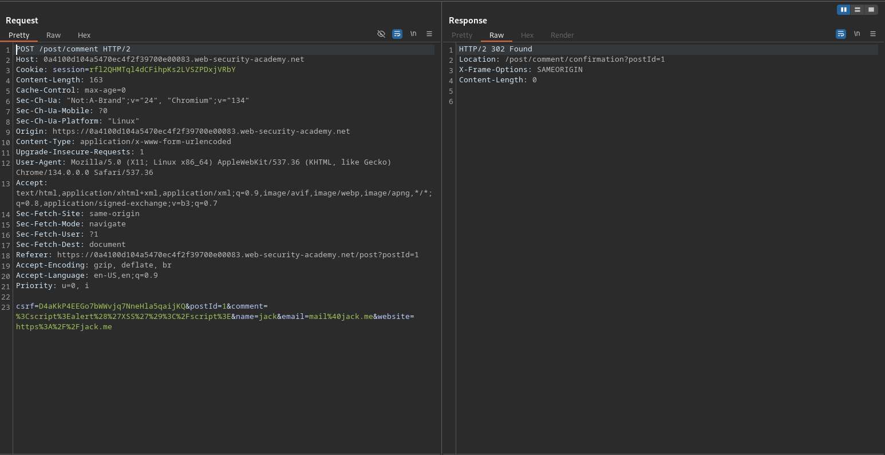
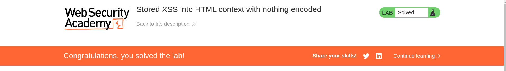

# Stored XSS into HTML context with nothing encoded

**Lab Url**: [https://portswigger.net/web-security/cross-site-scripting/stored/lab-html-context-nothing-encoded](https://portswigger.net/web-security/cross-site-scripting/stored/lab-html-context-nothing-encoded)

## Analysis

As usual, the initial step is to understand how the vulnerable application works and gather information about the target system. This application also serves as a collection of blog posts, but unlike the previous one, this application doesn't have a search bar.

Let's take a look at the posts itself. The post has a thumbnail (which is loaded from the `/image` directory), author, date of the post, and content. It also has a comment section.

Let's examine the comment section. The section has comment, name, email, and website fields.

## Payload

Let's inject some XSS Payload on the comment field.

Upon revisiting the same post, we successfully popped up an alert box.

