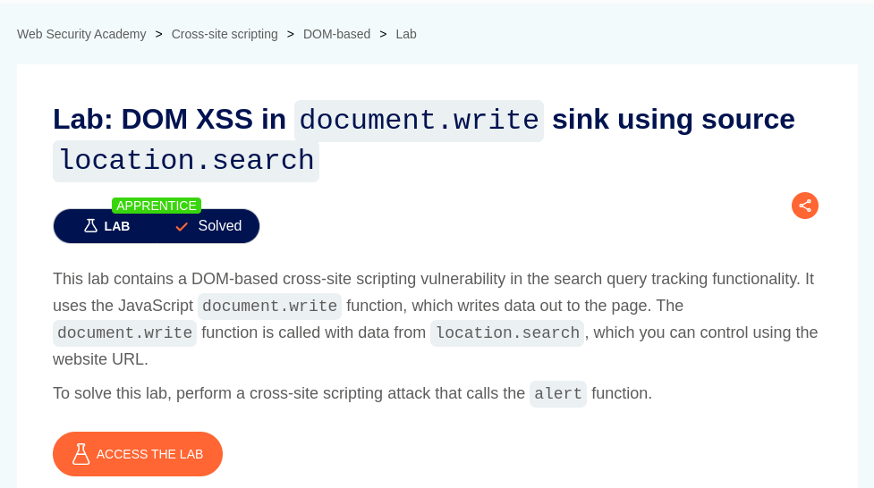
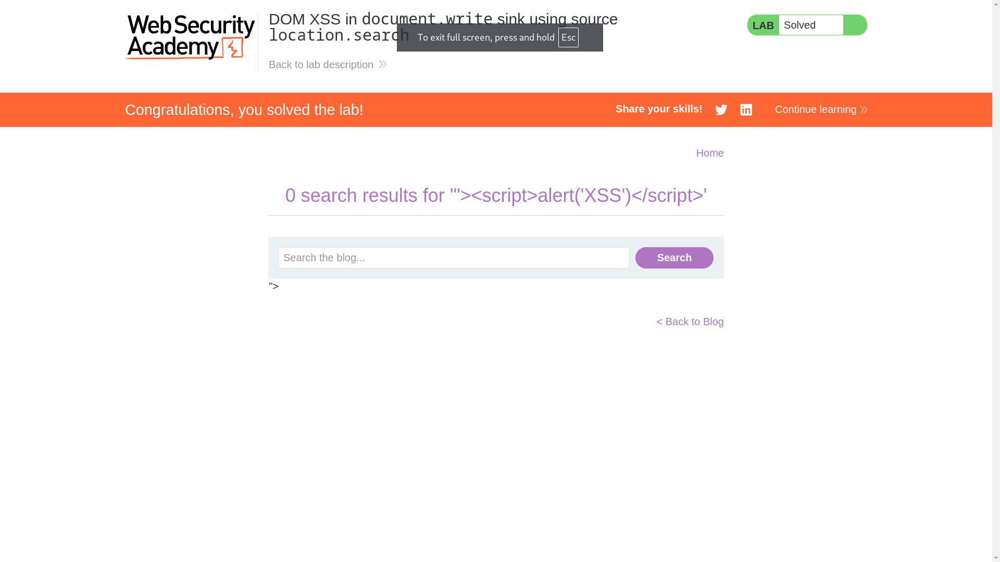

# DOM XSS in document.write sink using source location.search

**Lab Url**: [https://portswigger.net/web-security/cross-site-scripting/dom-based/lab-document-write-sink](https://portswigger.net/web-security/cross-site-scripting/dom-based/lab-document-write-sink)



## Analysis

As usual, the initial step is to understand how the vulnerable application works and gather information about the target system. This application also serves as a collection of blog posts. It also has a search bar on top of it. The search bar contains a form that requests the user **search query** using the `GET` Method.

When you submit the search query, you can inspect the source code of the page. It contains a `<script></script>` tag, and inside the `<script></script>` tag, it contains a `trackSearch` function.

```javascript
function trackSearch(query) {
    document.write('');
}
var query = (new URLSearchParams(window.location.search)).get('search');
if(query) {
    trackSearch(query);
}
```

This function takes the **search query parameter** and appends it to the image `src` attribute.

## Payload

With the correct payload, we can escape the DOM and inject a `<script></script>` tag.

```html
"><script>alert('XSS')</script>
```

The payload was successful, and we successfully popped up an alert box.


