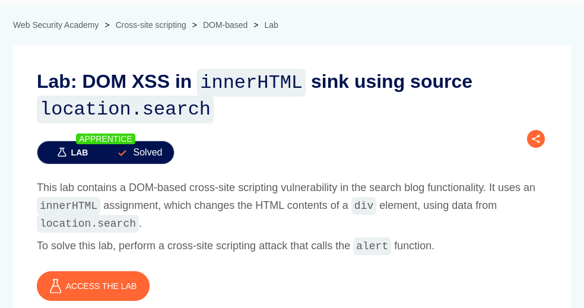

# DOM XSS in innerHTML sink using source location.search

**Lab Url**: [https://portswigger.net/web-security/cross-site-scripting/dom-based/lab-innerhtml-sink](https://portswigger.net/web-security/cross-site-scripting/dom-based/lab-innerhtml-sink)



## Analysis

As usual, the initial step is to understand how the vulnerable application works and gather information about the target system. This application also serves as a collection of blog posts. It also has a search bar on top of it. The search bar contains a form that requests the user **search query** using the `GET` Method.

The search page contains a `<script></script>` tag with the `doSearchQuery` function inside it.

```javascript
function doSearchQuery(query) {
    document.getElementById('searchMessage').innerHTML = query;
}
var query = (new URLSearchParams(window.location.search)).get('search');
if(query) {
    doSearchQuery(query);
}
```

This function takes the **search parameter** and appends it's content inside `<span id="searchMessage"></span>` as raw HTML.

## Payload

With the correct payload, we can escape the DOM and inject a `<script></script>` tag.

```html

```

```bash
/?search=
```

The payload was successful, and we successfully popped up an alert box.


