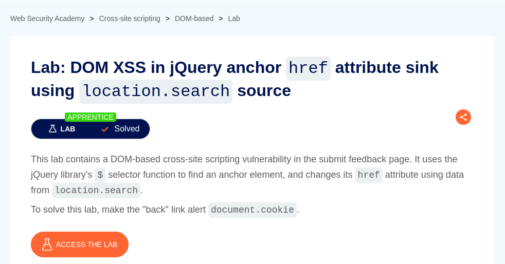

# DOM XSS in jQuery anchor href attribute sink using location.search source

**Lab Url**: [https://portswigger.net/web-security/cross-site-scripting/dom-based/lab-jquery-href-attribute-sink](https://portswigger.net/web-security/cross-site-scripting/dom-based/lab-jquery-href-attribute-sink)



## Analysis

As usual, the initial step is to understand how the vulnerable application works and gather information about the target system. The application contains a collection of posts and a submit feedback page on the navbar.

The submit feedback page has a form with name, email, subject, and message as its field. The feedback page also has a backlink that redirects users to the home page or to `/`.

If you look at the submit feedback page source code, you can see that it uses the jQuery library's `$` selector function to find an **`anchor`** element and change its **`href`** attribute using data from `location.search`.

```javascript
$(function() {
    $('#backLink').attr("href", (new URLSearchParams(window.location.search)).get('returnPath'));
});
                        
```

## Conclusion

The lab goal is to `alert()` the `document.cookie`. We can achieve that by injecting a javascript code on the `returnPath` of the URL.

```bash
/feedback?returnPath=javascript:alert(document.cookie)
```

The payload was successful, and we successfully popped up an alert box when user click the **"back"** link.


