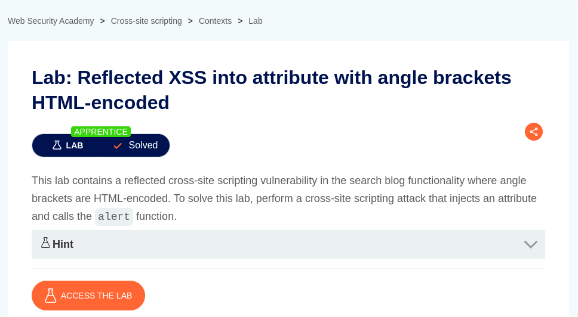
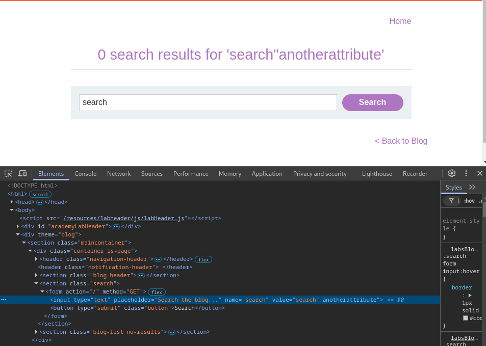

# Reflected XSS into attribute with angle brackets HTML-encoded

**Lab Url**: [https://portswigger.net/web-security/cross-site-scripting/contexts/lab-attribute-angle-brackets-html-encoded](https://portswigger.net/web-security/cross-site-scripting/contexts/lab-attribute-angle-brackets-html-encoded)



## Analysis

As usual, the initial step is to understand how the vulnerable application works and gather information about the target system. The application contains a catalog of blog posts and a search bar on top of it.

The search bar reflects the search query from the URL to the `h1` tag as text content.

However, the application shows a very interesting effect it also reflects the search query to input tag `value` attribute. If we add a double quote (`"`) in a search query, the query breaks out of the value attribute.



Now, we can craft a malicious payload that will pop an alert box.

```html
search"onfocus="javascript:alert(0)"autofocus="true
```


