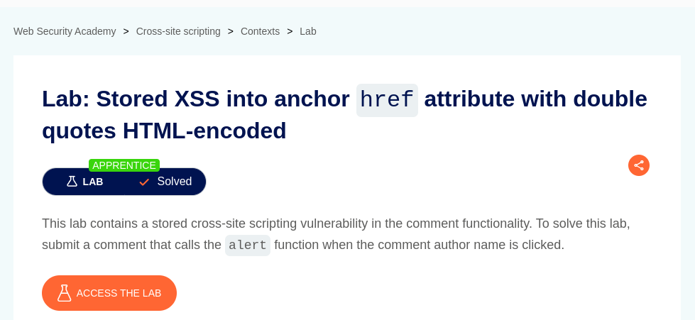
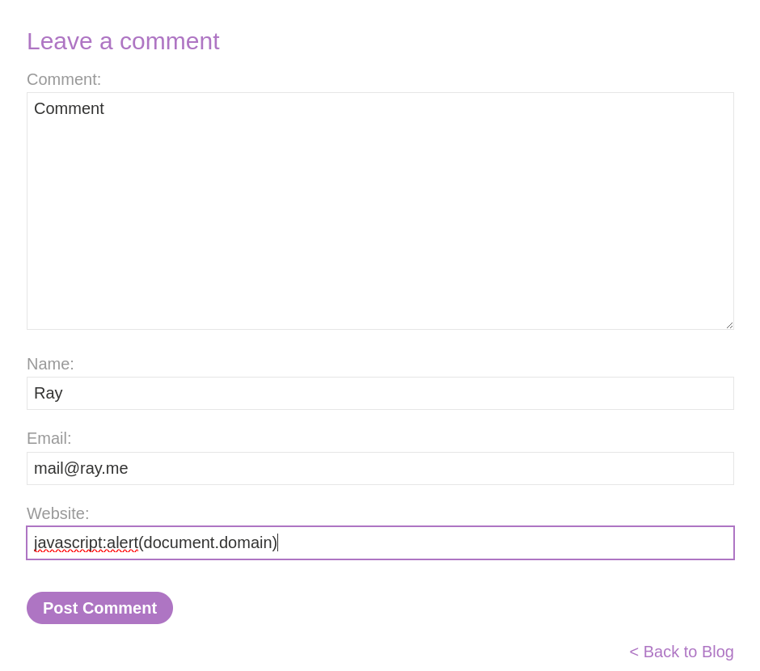

# Stored XSS into anchor href attribute with double quotes HTML-encoded

**Lab Url**: [https://portswigger.net/web-security/cross-site-scripting/contexts/lab-href-attribute-double-quotes-html-encoded](https://portswigger.net/web-security/cross-site-scripting/contexts/lab-href-attribute-double-quotes-html-encoded)

## Analysis

This lab features a collection of posts. Each post has a comment functionality at the bottom. The comment form contains a comment, name, email, and website field. The website field is rather interesting because if it is filled then the application wraps the Name inside an **anchor** tag with its `href` value equal to the user-provided website link.

Since we can control the value of `href` using the website field we can easily inject a malicious comment that calls the `alert()` function when the comment author name is clicked.

