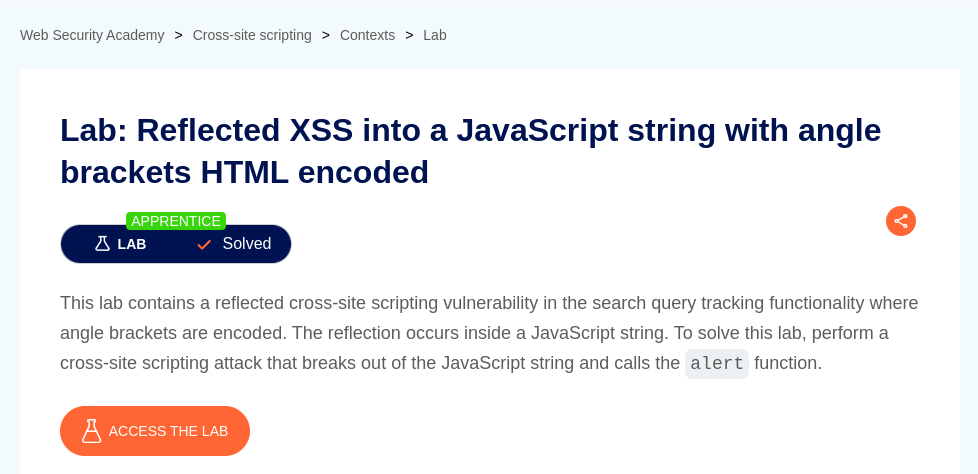

# Reflected XSS into a JavaScript string with angle brackets HTML encoded

**Lab Url**: [https://portswigger.net/web-security/cross-site-scripting/contexts/lab-javascript-string-angle-brackets-html-encoded](https://portswigger.net/web-security/cross-site-scripting/contexts/lab-javascript-string-angle-brackets-html-encoded)



## Analysis

This lab features a collection of posts with a search functionality on top of it. The search page has a code block that encodes the search parameter from the URL and adds it inside the `href` attribute of an image tab.

```javascript
var searchTerms = '';
document.write('');
```

The application takes carefull measure, and encodes the search parameter before adding it inside of `src` attribute of the `img` tag.

However, with the correct set of payloads, **it is possible to break out of syntax in line 56** `var searchTerms =''`.

We can pop an alert box using this payload.

```javascript
`"';alert(document.domain);//
```


