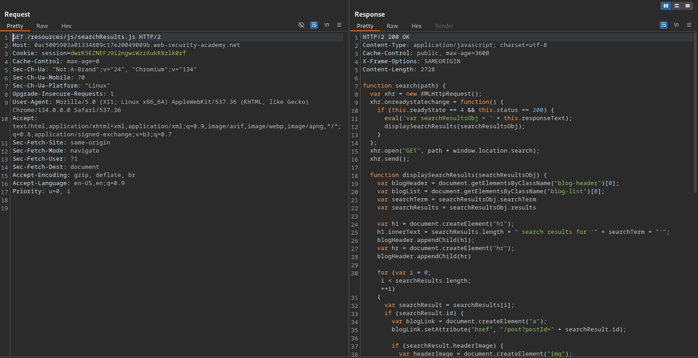
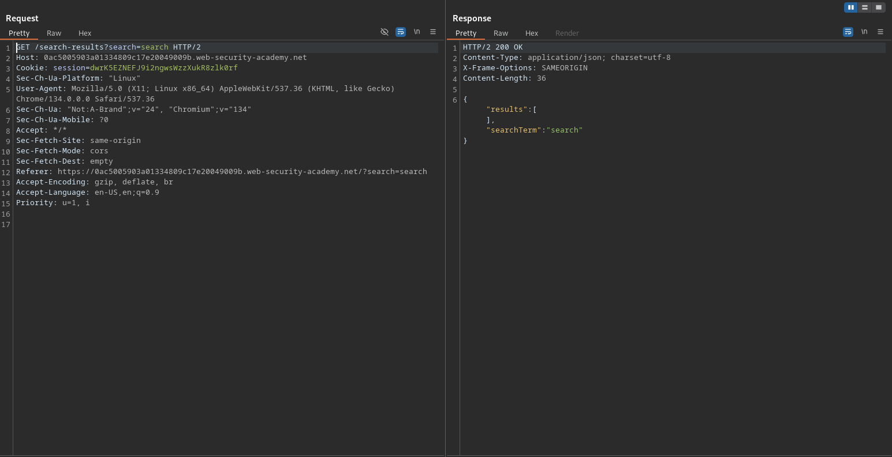
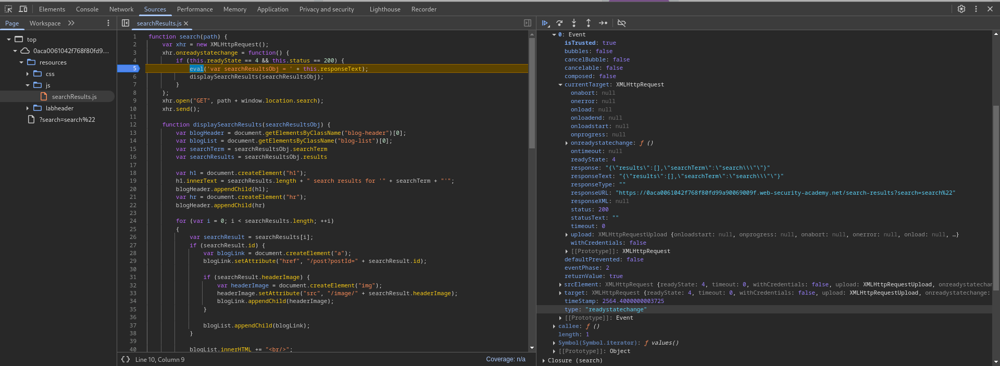
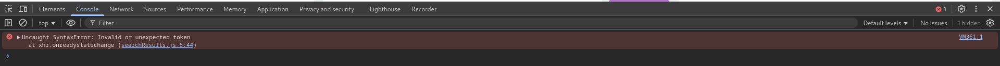
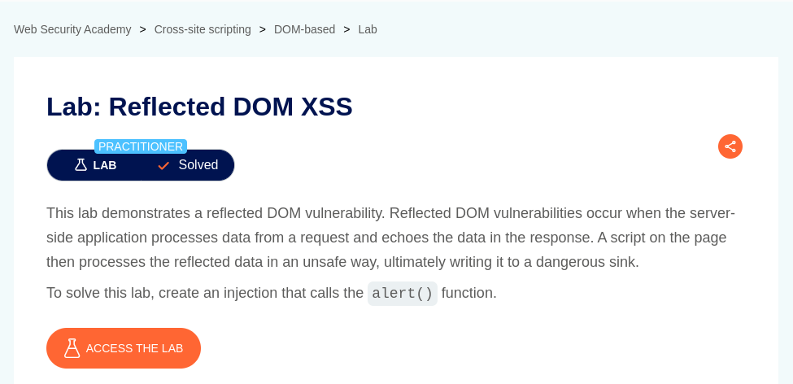

# DOM XSS in document.write sink using source location.search inside a select element

**Lab Url**: [https://portswigger.net/web-security/cross-site-scripting/dom-based/lab-dom-xss-reflected](https://portswigger.net/web-security/cross-site-scripting/dom-based/lab-dom-xss-reflected)


## Analysis

As usual, the initial step is to understand how the vulnerable application works and gather information about the target system. The application showcases a collection of posts and contains a search bar with search blog functionality.

The search page includes a `/resource/js/searchResults.js` file on line `45`. The javascript file executes an `XHR` request on the client side fetching the relevant post from URL `/search-results?search=SEARCH-TERM`.





The search result path `/search-results?search=search` returns an interesting field `searchTerm` which can be controlled by the user.

```json
{"results":[],"searchTerm":"search"}
```

## Solution

In line `5` of `/resource/js/searchResults.js`, a javascript code evaluates the response JSON in an unsafe manner, leaving a way to escape the javascript statement and execute any arbitrary code.

```javascript
eval('var searchResultsObj = ' + this.responseText);
```

**Since the application uses JSON format, we can escape the statement using a double quote (`"`). But the application is escaping the double quotes (`"`) with a backslash (`\`). To bypass this encoding we can append a backslash in our payload itself. (`\"`)**



We can verify that using `\"` works because now the application throws a `syntaxError`.



## Payload

To pop an alert box use the payload.

```javascript
"\"};alert(0);//
```


