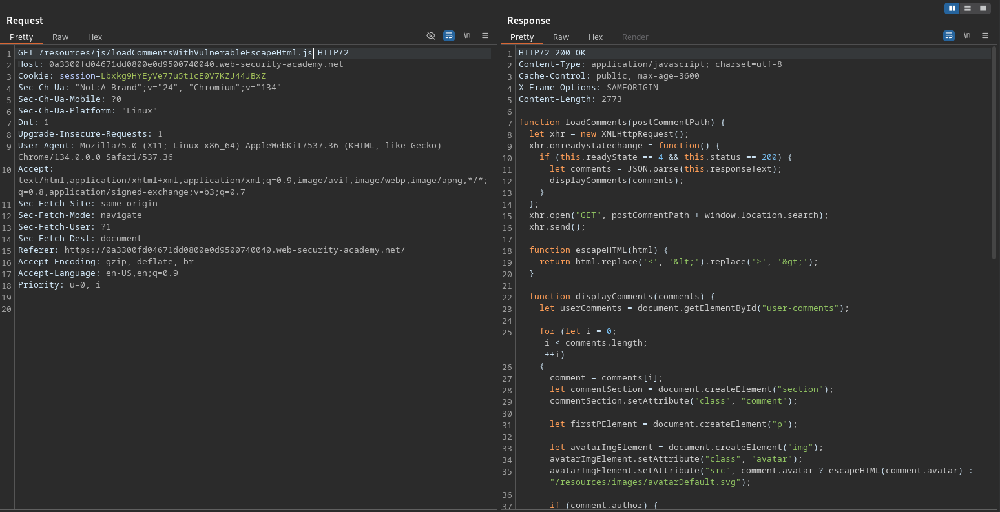
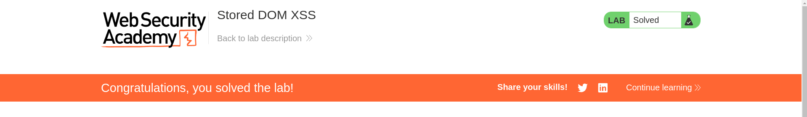

# Stored DOM XSS

**Lab Url**: [https://portswigger.net/web-security/cross-site-scripting/dom-based/lab-dom-xss-stored](https://portswigger.net/web-security/cross-site-scripting/dom-based/lab-dom-xss-stored)


## Analysis

As usual, the initial step is to understand how the vulnerable application works and gather information about the target system. The application showcases a collection of posts and contains a comment form on each post.

The post page loads a script file that performs some validation by HTML encoding angle brackets `>` and `<` before loading the content in DOM as raw HTML.

```javascript
function escapeHTML(html) {
    return html.replace('<', '&lt;').replace('>', '&gt;');
}
```



But this code has a fatal flaw by default, the `string.replace()` method in JavaScript only replaces the first occurrence of the specified substring.

Thus we can bypass this validation by using payloads like:

```html
<" onerror="alert(document.domain)" />
```

```html
<>
```

To solve this lab inject this payload on the comment form below the post page.


