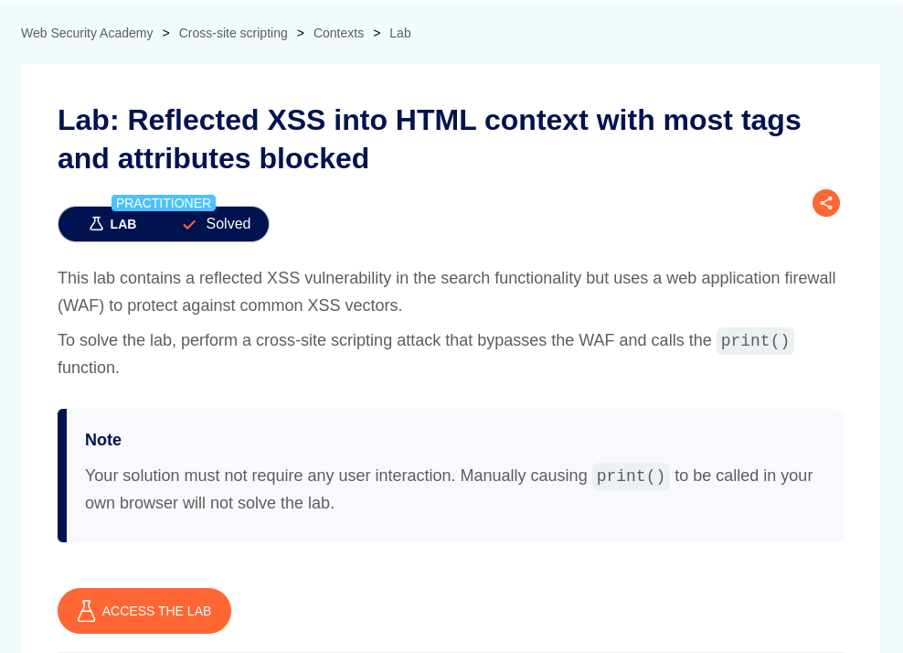
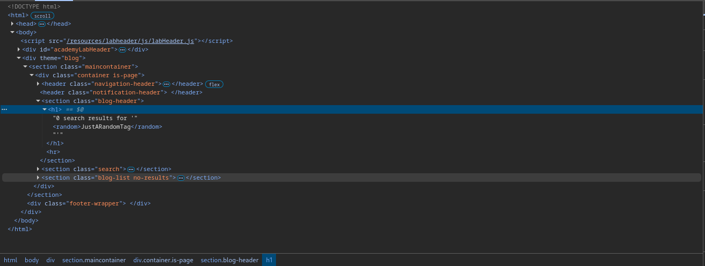
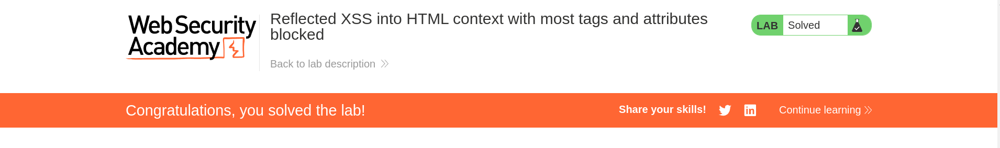

# Reflected XSS into HTML context with most tags and attributes blocked

**Lab Url**: [https://portswigger.net/web-security/cross-site-scripting/contexts/lab-html-context-with-most-tags-and-attributes-blocked](https://portswigger.net/web-security/cross-site-scripting/contexts/lab-html-context-with-most-tags-and-attributes-blocked)



## Analysis

According to this lab description, it contains a reflected XSS vulnerability in the search functionality but uses a web application firewall (WAF) to protect against common XSS vectors.

First, let's verify that the application is vulnerable to XSS attack and it reflects the user query to the DOM in an unsafe manner. But, we can't just inject a valid HTML tag because it will be blocked by **WAF**. So let's inject an invalid HTML tag to see if it is getting reflected in response without any adequate encoding.

Hmm, after injecting this tag `?search=<random>JustARandomTag</random>` we can see that it is getting reflected in an unsafe manner.



## Conclusion

If we inject a valid HTML tag like a `<script></script>` or `` the application will return a `400` status code error.
However, the lab description itself states that most tags and attributes are blocked but not all. We can use `ffuf` or any fuzzer to fuzz a list of XSS Payload to filter out which tag is allowed. [Payload List](https://github.com/blueorionn/xss-payload-list/blob/master/Intruder/xss-payload-list.txt)

After a bit of reconnaissance, it was found that body tag is allowed. However, attributes like `onclick` or `onload` are not.

After fuzzing with a list of all attributes with payload [wordlist/html-attributes.txt](https://github.com/blueorionn/portswigger-websecurity-academy-labs/tree/main/wordlist/html-attributes.txt), it was found that `onresize` is allowed.

## Payload

Now, we can deliver the exploit to the victim by placing the lab URL inside `src` and dynamically changing, the width of the `iframe` on load.

```html
<iframe src="https://YOUR-LAB-ID.web-security-academy.net/?search=%3Cbody%20onresize=%27print()%27%3E" onload="this.style.width='100px'"></iframe>
```


