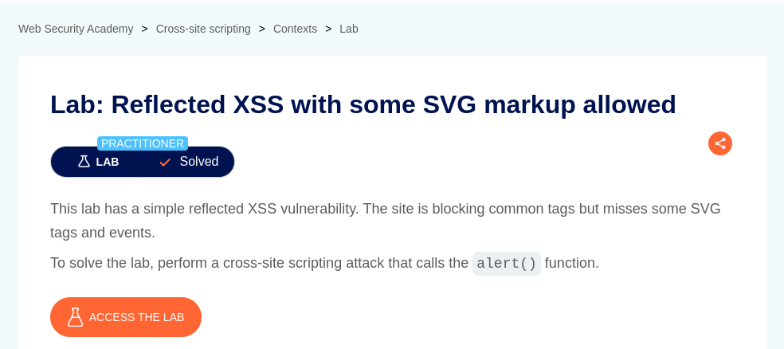
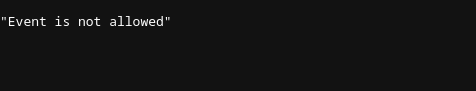
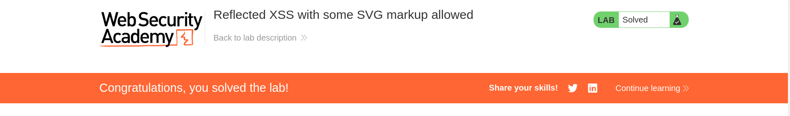

# Reflected XSS with some SVG markup allowed

**Lab Url**: [https://portswigger.net/web-security/cross-site-scripting/contexts/lab-some-svg-markup-allowed](https://portswigger.net/web-security/cross-site-scripting/contexts/lab-some-svg-markup-allowed)



## Analysis

According to this lab description, it contains a reflected XSS vulnerability in the search functionality but uses a web application firewall (WAF) to block common tags but misses some SVG tags and events.

We know that the application allows SVG tag, but let's inject an `onload` attribute and observe if it works.

We got a `400` Bad Request Error along with an error message `"Event is not allowed"`.



## Conclusion

I tried to fuzz SVG payloads from the [payload list](https://github.com/blueorionn/xss-payload-list/blob/master/Intruder/xss-payload-list.txt) to check which attribute is allowed.

## Payload

The payload mentioned below pops a valid `alert` box

```bash
?search=<svG/x=">"/oNloaD=confirm()//
```


