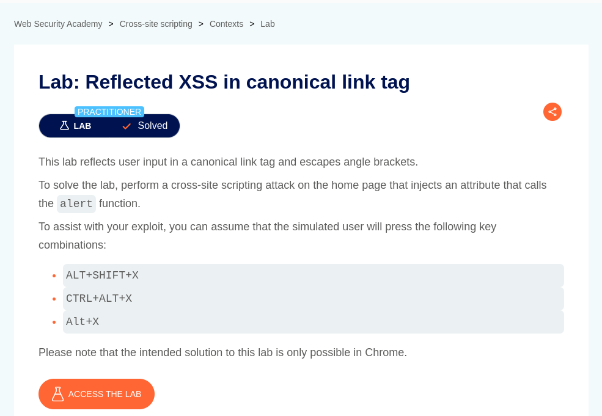
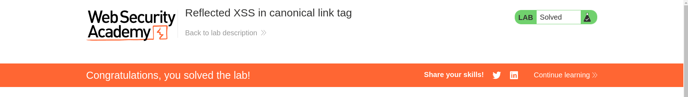

# Reflected XSS in canonical link tag

**Lab Url**: [https://portswigger.net/web-security/cross-site-scripting/contexts/lab-canonical-link-tag](https://portswigger.net/web-security/cross-site-scripting/contexts/lab-canonical-link-tag)



## Analysis

The lab reflects user input or current URL in a canonical link tag and escapes angle brackets.

## About

The canonical link tag is used in HTML to tell search engines which URL is the official (or preferred) version of a webpage — especially useful when the same content is accessible via multiple URLs.

The `accesskey` attribute in HTML is used to specify a keyboard shortcut to activate or focus an element. Chrome allows the user to press `accesskey` to open the URL specified in the href of the `<link>`. This is non-standard behavior, but Chrome implements it for certain rel values.

## Conclusion

We can abuse this functionality to perform an XSS attack with payload

```html
'accesskey='x'onclick='alert(1)
```

The URL will look like this

```bash
https://YOUR-LAB-ID.web-security-academy.net/?%27accesskey=%27x%27onclick=%27alert(1)
```


