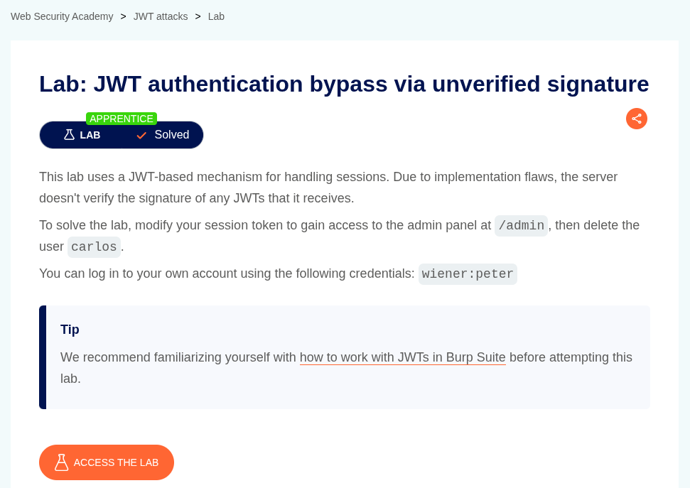
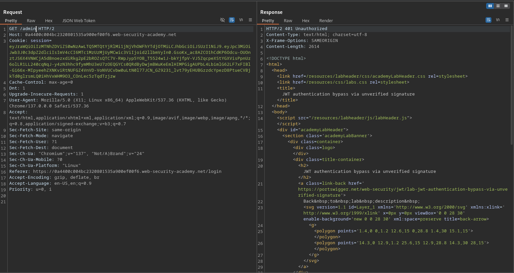
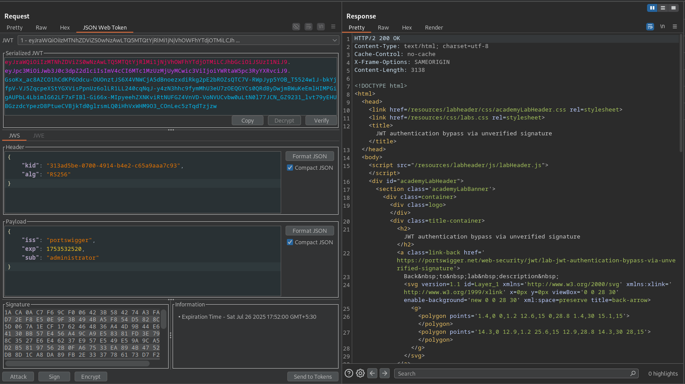
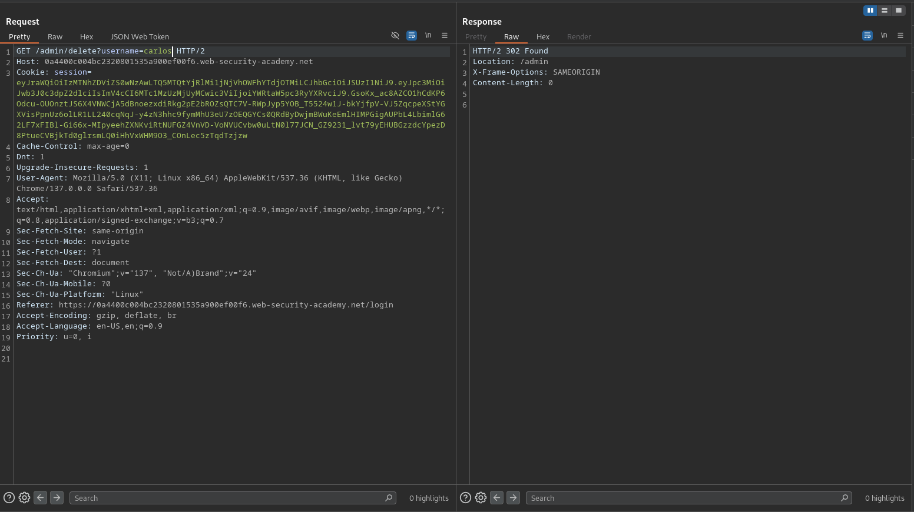
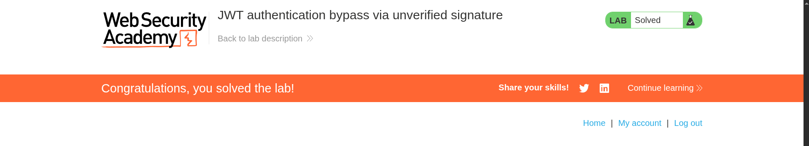

# JWT authentication bypass via unverified signature

**Lab Url**: [https://portswigger.net/web-security/jwt/lab-jwt-authentication-bypass-via-unverified-signature](https://portswigger.net/web-security/jwt/lab-jwt-authentication-bypass-via-unverified-signature)

## Objective

This lab uses a JWT-based mechanism for handling sessions. Due to implementation flaws, the server doesn't verify the signature of any JWTs that it receives.Modify your session token to gain access to the admin panel at `/admin`, then delete the user `carlos`.

## Solution

**Before beginning, install Burp JWT Editor Extension.**

In the lab, log in to your account using the credentials `wiener` and `peter`. Notice that the lab uses a **JWT-based** mechanism for handling sessions.

Now, try to access the lab's admin page `/admin`. Notice that you will get a **401 Unauthorized** status code.

Examine the JWT token in the `JSON Web Token` Panel of the Repeater tab. Notice that the payload has a **`sub`** parameter. Modify the value of `sub` from `wiener` to `administrator`.

Now you will be able to access the admin panel and delete the user `carlos` to solve the lab.

