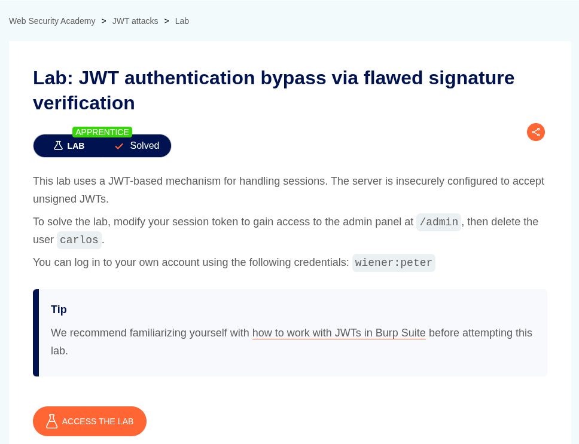

# JWT authentication bypass via flawed signature verification

**Lab Url**: [https://portswigger.net/web-security/jwt/lab-jwt-authentication-bypass-via-flawed-signature-verification](https://portswigger.net/web-security/jwt/lab-jwt-authentication-bypass-via-flawed-signature-verification)

## Objective

This lab uses a JWT-based mechanism for handling sessions. The server is insecurely configured to accept unsigned JWTs.To solve the lab, modify your session token to gain access to the admin panel at `/admin`, then delete the user `carlos`.

## Solution

In the lab, log in to your account using the credentials `wiener` and `peter`. Notice that the lab uses a **JWT-based** mechanism for handling sessions.

Now, try to access the lab's admin page `/admin`. Notice that you will get a **401 Unauthorized** status code.

Examine the JWT token in the `JSON Web Token` Panel of the Repeater tab. Notice that the payload has a **`sub`** parameter. Modify the value of `sub` from `wiener` to `administrator` and change the `alg` value to `none` in the JWT header.

Now you will be able to access the admin panel and delete the user `carlos` to solve the lab.

