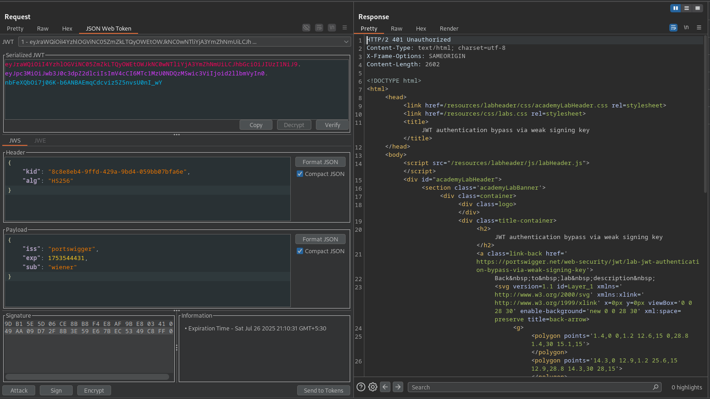

# JWT authentication bypass via weak signing key

**Lab Url**: [https://portswigger.net/web-security/jwt/lab-jwt-authentication-bypass-via-weak-signing-key](https://portswigger.net/web-security/jwt/lab-jwt-authentication-bypass-via-weak-signing-key)


## Objective

This lab uses a JWT-based mechanism for handling sessions. It uses an extremely weak secret key to both sign and verify tokens.To solve the lab, first brute-force the website's secret key. Once you've obtained this, use it to sign a modified session token that gives you access to the admin panel at `/admin`, then delete the user `carlos`.

## Solution

After logging in to your account, notice that the JWT token uses the **`HS256`** algorithm. The HS256 algorithm (HMAC + SHA-256) uses a **"symmetric"** key. This means that the server uses a single key to both sign and verify the token. This token needs to be kept secret.



This lab uses an extremely weak secret key. It is possible to brute force the secret token using the command below with [this](https://github.com/wallarm/jwt-secrets/blob/master/jwt.secrets.list) wordlist.

```bash
hashcat -a 0 -m 16500 <YOUR-JWT> /path/to/jwt.secrets.list
```

In this case, the secret token is `secret1`.


### Generate a forged signing key

1. Using Burp Decoder, Base64 encode the secret that you brute-forced.

2. In Burp, go to the **JWT Editor Keys** tab and click **New Symmetric Key**. In the dialog, click Generate to generate a new key in JWK format.

3. Replace the generated value for the `k` property with the Base64-encoded secret.

4. Click OK to save the key.


### Modify and sign the JWT

1.Examine the JWT token in the `JSON Web Token` Panel of the Repeater tab. Notice that the payload has a **`sub`** parameter. Modify the value of `sub` from `wiener` to `administrator`.

2.At the bottom of the tab, click **`Sign`**, then select the key that you generated in the previous section.

3.Make sure that the Don't modify header option is selected, then click OK. The modified token is now signed with the correct signature.


Now, access the admin panel `/admin` and delete the user `carlos` to solve the lab.


