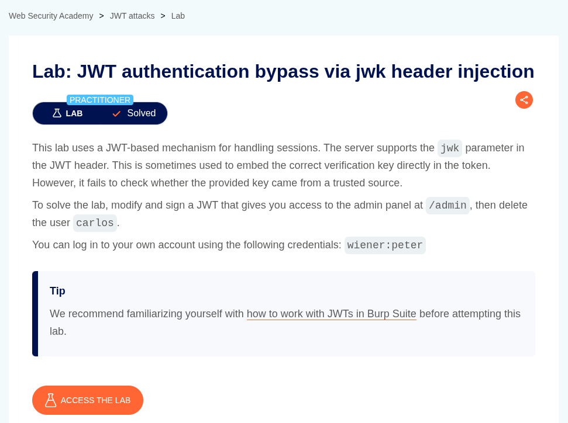
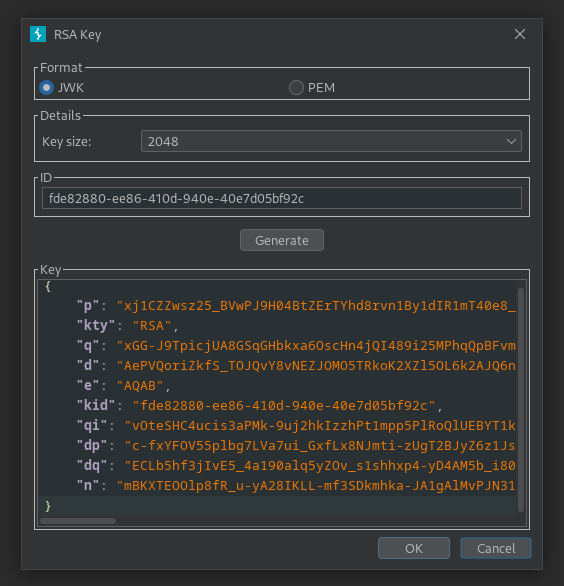
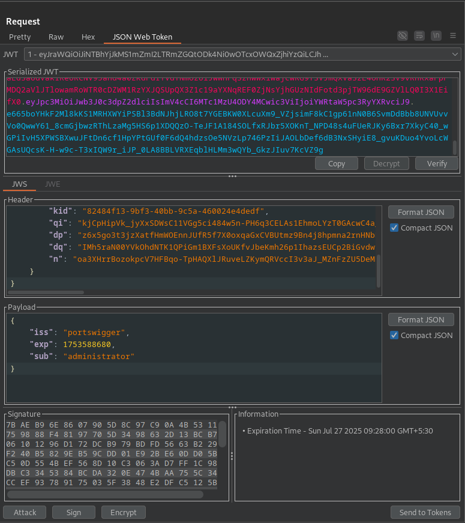
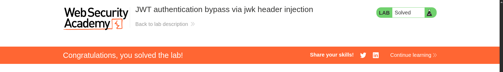

# JWT authentication bypass via jwk header injection

**Lab Url**: [https://portswigger.net/web-security/jwt/lab-jwt-authentication-bypass-via-jwk-header-injection](https://portswigger.net/web-security/jwt/lab-jwt-authentication-bypass-via-jwk-header-injection)



## Objective

This lab uses a JWT-based mechanism for handling sessions. The server supports the `jwk` parameter in the JWT header. This is sometimes used to embed the correct verification key directly in the token. However, it fails to check whether the provided key came from a trusted source.

To solve the lab, modify and sign a JWT that gives you access to the admin panel at `/admin`, then delete the user `carlos`.

## Solution

After logging in to your account and visiting the `/admin` page, you will get a `401` Unauthorized status.

In the Burp **JWT editor**, create a new RSA key and copy it as `JWK`.



In the **JSON web editor** of the repeater tab, edit the header of JWT, remove the `kid` parameter, and add the `jwk` parameter with your copied value. It should look something like this.

```json
{
    "alg": "RS256",
    "jwk": {
        "p": "some-random-value",
        "kty": "RSA",
        "q": "some-random-value",
        "d": "some-random-value",
        "e": "AQAB",
        "kid": "some-random-value",
        "qi": "some-random-value",
        "dp": "some-random-value",
        "dq": "some-random-value",
        "n": "some-random-value"
    }
}
```



Now change the `sub` parameter from `wiener` to `administrator` and sign the JWT token with your created RSA key. Now you should be able to access the `/admin` page and delete the user `carlos`.


