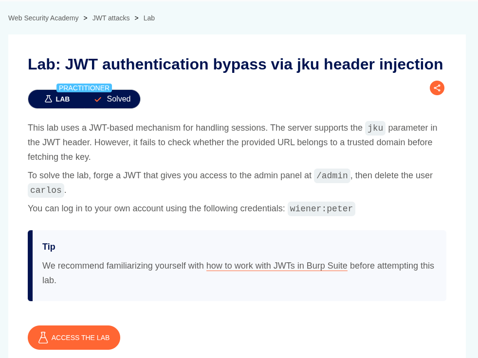
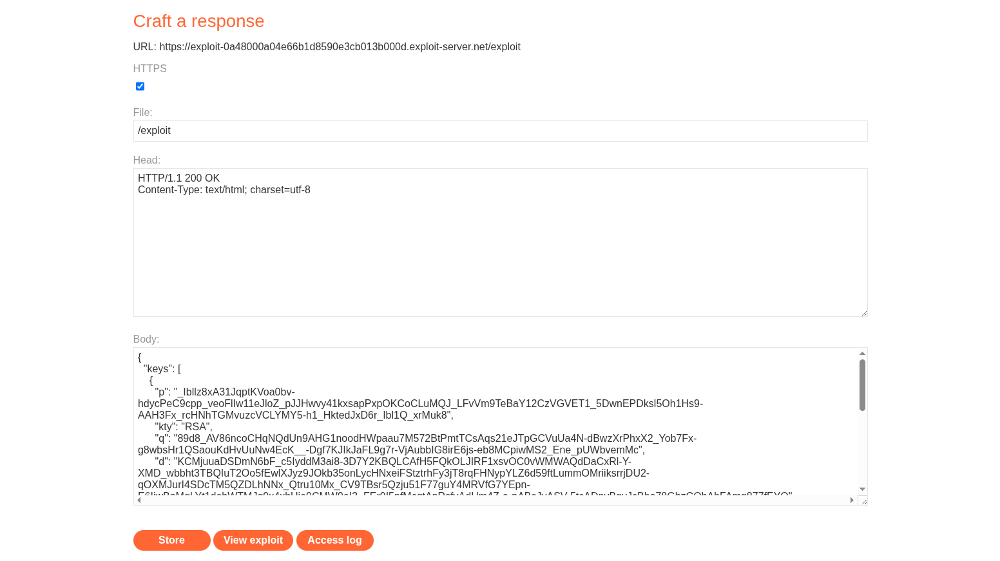
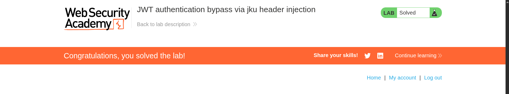

# JWT authentication bypass via jku header injection

**Lab Url**: [https://portswigger.net/web-security/jwt/lab-jwt-authentication-bypass-via-jku-header-injection](https://portswigger.net/web-security/jwt/lab-jwt-authentication-bypass-via-jku-header-injection)



## Objective

This lab uses a JWT-based mechanism for handling sessions. The server supports the `jku` parameter in the JWT header. However, it fails to check whether the provided URL belongs to a trusted domain before fetching the key.

To solve the lab, forge a JWT that gives you access to the admin panel at `/admin`, then delete the user `carlos`.

## Solution

After logging in to your account and visiting the `/admin` page, you will get a 401 Unauthorized status.

In the Burp **JWT editor**, please create a new RSA key and copy it as JWK. Now go to the exploit server and add JWK Set as a JSON object containing an array of JWKs representing different keys. It should look something like this.

```json
{
    "keys": [
        {
            "kty": "RSA",
            "e": "AQAB",
            "kid": "75d0ef47-af89-47a9-9061-7c02a610d5ab",
            "n": "o-yy1wpYmffgXBxhAUJzHHocCuJolwDqql75ZWuCQ_cb33K2vh9mk6GPM9gNN4Y_qTVX67WhsN3JvaFYw-fhvsWQ"
        },
        {
            "kty": "RSA",
            "e": "AQAB",
            "kid": "d8fDFo-fS9-faS14a9-ASf99sa-7c1Ad5abA",
            "n": "fc3f-yy1wpYmffgXBxhAUJzHql79gNNQ_cb33HocCuJolwDqmk6GPM4Y_qTVX67WhsN3JvaFYw-dfg6DH-asAScw"
        }
    ]
}
```



Now modify the kid parameter in your JWT token to match the value in one of your keys from the **exploit server**. Now, change the `sub` parameter from `wiener` to `administration`, sign the key, and you should be able to access the `/admin` page. Now, delete the user `carlos` to solve the lab.


