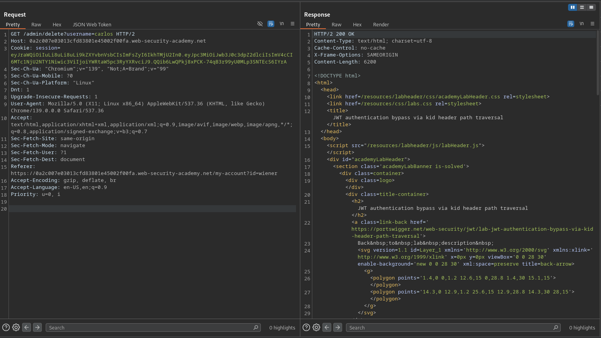

# JWT authentication bypass via kid header path traversal

**Lab Url**: [https://portswigger.net/web-security/jwt/lab-jwt-authentication-bypass-via-kid-header-path-traversal](https://portswigger.net/web-security/jwt/lab-jwt-authentication-bypass-via-kid-header-path-traversal)

## Objective

This lab uses a JWT-based mechanism for handling sessions. In order to verify the signature, the server uses the `kid` parameter in JWT header to fetch the relevant key from its filesystem.

To solve the lab, forge a JWT that gives you access to the admin panel at `/admin`, then delete the user `carlos`.

## Solution

After logging in to your account, notice that the JWT token uses the **HS256** algorithm. Also, the lab description indicates that the `kid` parameter is vulnerable to a path traversal attack. This hints that arbitrary files can potentially be used as a verification key in the JWT token.

We can test this using an empty file present in most Linux systems `/dev/null`.

In the JWT Editor of Burp, create a new symmetric key with secret `A==`.

Modify the JWT header `sub` parameter to `administrator` and the `kid` parameter to `/dev/nul`l file path. With the correct relative path, you should be able to access the `/admin` page. Now, delete the user Carlos to solve the lab.

